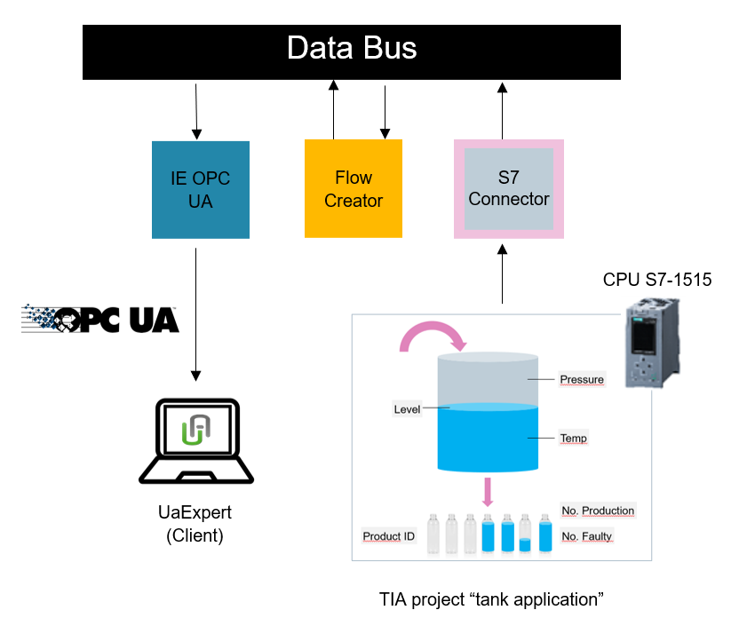

# OPC UA Application example

This example shows how to use Industrial Edge OPC UA Application.

- [OPC UA Application example](#opc-ua-application-example)
  - [Description](#description)
    - [Overview](#overview)
    - [General Task](#general-task)
  - [Requirements](#requirements)
    - [Prerequisites](#prerequisites)
    - [Used components](#used-components)
    - [TIA Project](#tia-project)
  - [Configuration steps](#configuration-steps)
  - [Usage](#usage)
  - [Documentation](#documentation)
  - [Contribution](#contribution)
  - [License and Legal Information](#license-and-legal-information)

## Description

### Overview

Industrial Edge (IE) OPC-UA application acts as OPC-UA server. It connects to the data source and extract the data using Industrial Edge Databus (IE Databus). The data source can be SIMATIC S7 Connector, PROFINET IO Connector, Modbus TCP Connector and Ethernet/IP Connector. Customized data sources can also be created. Then connected data, makes available for OPC-UA clients.

### General Task

In this example, data were collected from PLC with S7 connector and publish to IE Databus. From that data, in IE Flow Creator, KPIs were calculated and new custom data source is created. IE OPC-UA Application, subscribes to these to data sources and make them available to OPC-UA client like UA Expert.

## Requirements

### Prerequisites

- Access to an Industrial Edge Management System (IEM).
- Onboarded Industial Edge Device (IED) on IEM.
- Installed System Configurators for Databus.
- Installed System Apps Databus.
- Installed and running all connectors and configurators (S7 conector, PROFINET IO, ModbusTCP) that Application uses.
- Installed OPC UA configurator and OPC UA Application.
- Installed IE Flow Creator.
- Google Chrome (Version ≥ 72) or Firefox (Version ≥ 62).

### Used components

- Industrial Edge Management (IEM) V1.3.0-58
- IE Databus Configurator V1.4.22
- IE Databus V1.3.5
- Simatic S7 Connector Configurator V1.4.9
- Simatic S7 Connector V1.3.27
- IE OPC UA configurator V1.0.15
- IE OPC UA V1.0.22
- IE Flow Creator V1.1.10
- Industrial Edge Device V1.3.0-57
- TIA Portal V16
- PLC S7-1515
- Web browser (Mozilla or Chrome)

### TIA Project

The used TIA Portal project can be found in the [miscellenous repository](https://github.com/industrial-edge/miscellaneous/tree/main/tank%20application) and is also used for several further application examples.

## Configuration steps

You can find the further information about the following steps in the [docs](docs/Installation.md)

- Install and configure IE Databus.
- Install and configure IE S7 Connector.
- Collect data in IE Flow Creator and calculate KPIs.
- Create custom data source (new metadata, publish data to new topic).
- Install and configure OPC UA configurator and application.

## Usage

When previous steps are configured correctly, data is available in OPC-UA Application. Use UE Expert to connect to IE OPC UA Application at end point `opc.tcp://Ip-Address-of-Edge-Device:48010`.

## Documentation

You can find further documentation and help in the following links

- [Industrial Edge Hub](https://iehub.eu1.edge.siemens.cloud/#/documentation)
- [Industrial Edge Forum](https://www.siemens.com/industrial-edge-forum)
- [Industrial Edge landing page](https://new.siemens.com/global/en/products/automation/topic-areas/industrial-edge/simatic-edge.html)
- [Industrial Edge GitHub page](https://github.com/industrial-edge)

## Contribution

Thank you for your interest in contributing. Anybody is free to report bugs, unclear documentation, and other problems regarding this repository in the Issues section. Everybody is free to propose any changes to this repository using Pull Requests.

## License and Legal Information

Please read the [Legal information](LICENSE.md).
