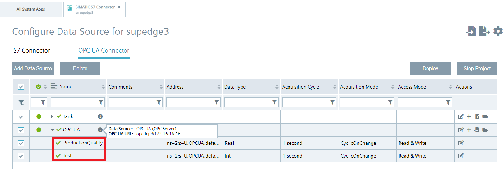

# OPC UA Application example

This example shows how to use Industrial Edge OPC UA Application.

- [OPC UA Application example](#opc-ua-application-example)
  - [Description](#description)
    - [Overview](#overview)
    - [General Task](#general-task)
  - [Requirements](#requirements)
    - [Prerequisites](#prerequisites)
    - [Used components](#used-components)
    - [TIA Project](#tia-project)
  - [Configuration steps](#configuration-steps)
  - [Usage](#usage)
  - [Documentation](#documentation)
  - [Contribution](#contribution)
  - [License and Legal Information](#license-and-legal-information)

## Description

### Overview

Industrial Edge OPC UA application acts as OPC UA server. It connects to the data source and extract the data using Industrial Edge Databus (Databus). The data source can be OPC UA Connector, PROFINET IO Connector, Modbus TCP Connector and Ethernet/IP Connector. Customized data sources can also be created. When data are connected and server configured, data becomes available for OPC UA clients.

### General Task

In this example, data were collected from PLC with OPC UA connector and publish to Databus. From that data, in Flow Creator, KPIs were calculated and new custom data source is created. OPC UA Application, subscribes to these two data sources and makes them available for OPC UA clients. As client, another IED can be used or some another application like UA Expert.

## Requirements

### Prerequisites

- Access to an Industrial Edge Management System (IEM)
- Onboarded Industial Edge Device (IED) on IEM
- Installed System Configurators for Databus
- Installed System Apps Databus
- Installed and running all connectors and configurators (OPC UA Connector, PROFINET IO, ModbusTCP) that Application uses
- Installed OPC UA configurator and OPC UA Application
- Installed Flow Creator
- Google Chrome (Version ≥ 72) or Firefox (Version ≥ 62)

### Used components

- Industrial Edge Management (IEM) V1.5.2-4
- Databus V2.1.0
- OPC UA Connector V1.8.1
- Flow Creator V1.12.0
- Industrial Edge Device V1.08.0-6
- TIA Portal V17
- PLC S7-1513
- Web browser (Mozilla or Chrome)

### TIA Project

The used TIA Portal project can be found in the [miscellenous repository](https://github.com/industrial-edge/miscellaneous/tree/main/tank%20application) and is also used for several further application examples.

## Configuration steps

You can find the further information about the following steps in the [docs](docs/Installation.md)

- Configure Databus
- Configure OPC UA Connector
- Collect data in Flow Creator and calculate KPIs
- Create custom data source (new metadata, publish data to new topic)
- Install and configure OPC UA configurator and application

## Usage

When previous steps are configured correctly, data are available in OPC UA Application. Use UA Expert to connect to IE OPC UA Application at end point `opc.tcp://Ip-Address-of-Edge-Device:48010`. You can also use second IED. Then data is obtained via SIMATIC S7 Connector (OPC UA Connector).

## Documentation

You can find further documentation and help in the following links

- [Industrial Edge Hub](https://iehub.eu1.edge.siemens.cloud/#/documentation)
- [Industrial Edge Forum](https://www.siemens.com/industrial-edge-forum)
- [Industrial Edge landing page](https://new.siemens.com/global/en/products/automation/topic-areas/industrial-edge/simatic-edge.html)
- [Industrial Edge GitHub page](https://github.com/industrial-edge)

## Contribution

Thank you for your interest in contributing. Anybody is free to report bugs, unclear documentation, and other problems regarding this repository in the Issues section.
Additionally everybody is free to propose any changes to this repository using Pull Requests.

If you are interested in contributing via Pull Request, please check the [Contribution License Agreement](Siemens_CLA_1.1.pdf) and forward a signed copy to [industrialedge.industry@siemens.com](mailto:industrialedge.industry@siemens.com?subject=CLA%20Agreement%20Industrial-Edge).

## License and Legal Information

Please read the [Legal information](LICENSE.txt).
