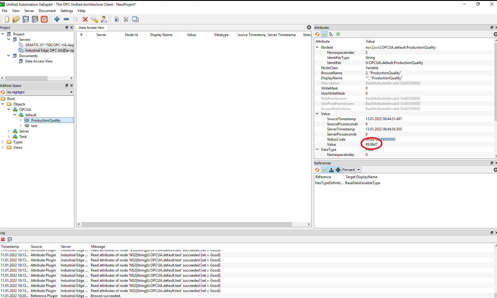

# Configuration

- [Configuration](#configuration)
  - [Configure IE Databus](#configure-ie-databus)
  - [Configure IE SIMATIC S7 Connector](#configure-ie-simatic-s7-connector)
  - [Collect data in IE Flow Creator and calculate KPIs](#collect-data-in-ie-flow-creator-and-calculate-kpis)
  - [Create custom data source (new metadata, publish data to new topic)](#create-custom-data-source-new-metadata-publish-data-to-new-topic)
  - [Install and configure OPC UA configurator and application](#install-and-configure-opc-ua-configurator-and-application)
  
## Configure IE Databus

In your IEM open the IE Databus and launch the configurator.
Add a user with this topic:
`"ie/#"`

Deploy the configuration.

## Configure IE SIMATIC S7 Connector

In your IEM open the SIMATIC S7 Connector and launch the configurator.

Add a data source:

Add needed tags (since we want to write variable values into the PLC, set "Read & Write" as access mode):

>Hint: Use the same tag names as in above picture. This names are used to calculate KPI in Flow Creator. If you change the names here, change it also in Flow Creator.

Edit the settings for Databus in upper right corner:

>Hint: Username and password should be the same as it was set in the IE Databus configuration, e.g., "edge" / "edge".

Deploy and start the project.

## Collect data in IE Flow Creator and calculate KPIs

Open the IE Flow Creator App from the IED Web UI and import the [flows.json](../src/flows.json) file from the source folder.

After importing the JSON file, the password for IE Databus must be entered in the security settings of the MQTT-node.

When flow is imported, it should look like:

Metadata from all connectors are coming in topic `ie/m/#`.
**Yellow** group, receives all metadata and builds `NameIDMap` global map with name-ID pairs.
**Blue** group receives dataPoints from all connectors and builds two global maps `IDValueMap` with ID-Value and `IDTimestampMap` with ID-Timestamp values.
**Green** group is used for setting metadata for new data source. Metadata and dataPoints needs to follow common payload JSON format.

Topic for new metadata is `ie/m/j/simatic/v1/opcua1/dp` and topic for dataPoints is `ie/d/j/simatic/v1/opcua1/dp/r/OPCUA/default`.
Metadata MQTT node should be retained.

## Create custom data source (new metadata, publish data to new topic)

**Orange** group in Flow Creator, calculates KPI when new data comes. Then, it formats the data in JSON payload format and sends to topic `ie/d/j/simatic/v1/opcua1/dp/r/OPCUA/default`.

## Install and configure OPC UA configurator and application

When previous steps are completed and KPI is calculated, OPC UA needs to be configured. This is done in IE Management -> Data Connections.

First, configure data source connection under "Data Source" tab. Insert SIMATIC S7 connector and new custom data source with KPI values. When you finish, you must either click **Deploy** or click **Add Data Source** icon to reflect the changes on the corresponding data points.

In "Data Points" tab, you can view and select all data points from configured data sources.

Next, select security policy under "Security" tab. For now, select security to **None** and **Generate self signed certificate**. In "User Management" you can create a OPC UA users. Select **Enable guest access**. Later, configure security according your demands.

Finally click **Deploy**.

After deployment finishes, data points will be available for OPC UA clients.
You can use UE Expert or second IED to test is it working. On second IED, data is obtained via SIMATIC S7 Connector (OPC UA Connector) as it is described previously.

