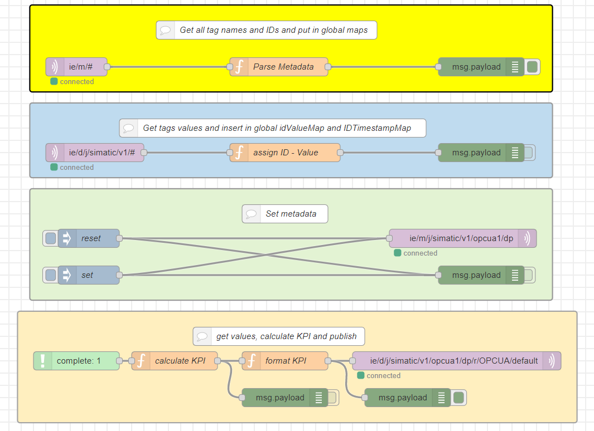
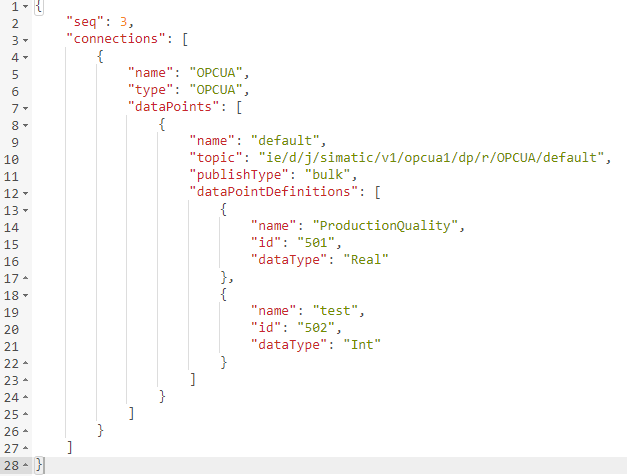
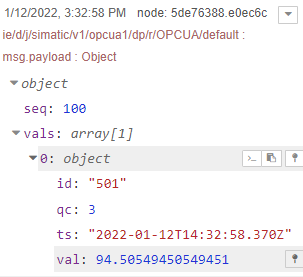

# Configuration

- [Configuration](#configuration)
  - [Configure PLC Connection](#configure-PLC_Connections)
  - [Configure Databus](#configure-databus)
  - [Configure OPC UA connector](#configure-OPC-UA-connector)
  - [Collect data in Flow Creator and calculate KPIs](#collect-data-in-flow-creator-and-calculate-kpis)
  - [Create custom data source (new metadata, publish data to new topic)](#create-custom-data-source-new-metadata-publish-data-to-new-topic)
  - [Install and configure Edge OPC UA Server and application](#install-and-configure-Edge-OPC-UA-Server-and-application)

## Configure PLC Connection

To read the data from the PLC and provide the data, we will use OPC UA connector to establish connection with the PLC via OPC UA.

Activate the OPC UA server

in order to build this infrastructure, these apps must be configured properly:
  - Databus
  - OPC UA Connector 

  
## Configure Databus

In your IEM open the Databus and launch the configurator.

Add a user with this topic:
`"ie/#"`

Deploy the configuration.

## Configure OPC UA Connector

OPC UA connector can be configured via both bellow mentioned options

###### a) Local configuration with industrial edge device
###### b) Central configuration with industrial edge managment

#### Local Configuration

In your industrial edge devic open the common congigurator and configure the OPC UA connector 

This configuration done localy at the industrial edge Device

Add a data source:

 

Add a data Databus credentials in common configurator:

 

Hint: Username and password should be the same as was set in the databus configuration, e.g., "edge" / "edge".

Deploy and start the project.

Import the tags to OPC UA connector, In common configurator, From OPC UA.xml file exported from TIA portal:

 

 

Add these four tags GDB.signal.energySignals.energyConsumptionHeatingTank, GDB.signals.energySignals.energyConsumptionFillingBottles, GDB.process.numberProduced, GDB.process.numberFaulty (since we want to write variable values into the PLC, set "Read & Write" as access mode):

>Hint! Please use the same variable names as shown in the screenshot, otherwise the flow creator script must be adjusted.

#### Central Configuration

In your IEM open the OPC UA Connector and launch the configurator.

This configurator done centraly at IEM

Add a data source:

Browse the tags from PLC

Add these four tags GDB.signal.energySignals.energyConsumptionHeatingTank, GDB.signals.energySignals.energyConsumptionFillingBottles, GDB.process.numberProduced, GDB.process.numberFaulty (since we want to write variable values into the PLC, set "Read & Write" as access mode):

 

>Hint: Use the same tag names “ProducedBottles” and “FaultyBottles”. This names are used to calculate KPI in Flow Creator. If you change the names here, change it also in Flow Creator.

Edit the settings for Databus in upper right corner:

>Hint: Username and password should be the same as it was set in the IE Databus configuration, e.g., "edge" / "edge".

Deploy and start the project.

## Collect data in Flow Creator and calculate KPIs

Open the Flow Creator App from the IED Web UI and import the [flows.json](../src/flows.json) file from the source folder.

When flow is imported, it should look like:

After importing the JSON file, the password for Databus must be entered in the security settings of the MQTT-node.

Metadata from all connectors are coming in topic `ie/m/#`. **Yellow** group, receives all metadata and builds `NameIDMap` global map with name-ID pairs. Enabling debug node, metadata can be visible in debug window.

>HINT: Metadata are retentive and are not pushed constantly. They are published on establishing connection or on change.

**Blue** group receives dataPoints from all connectors and builds two global maps `IDValueMap` with ID-Value and `IDTimestampMap` with ID-Timestamp values. These maps stores only the last value.

## Create custom data source (new metadata, publish data to new topic)

**Green** group is used for setting metadata for new data source. Metadata and dataPoints needs to follow common payload JSON format. Topic for new metadata is `ie/m/j/simatic/v1/opcua1/dp` and topic for dataPoints is `ie/d/j/simatic/v1/opcua1/dp/r/OPCUA/default`. In inject node "set", you can customize your new metadata topic. There, you need to add name and type of connector, topic and definitions for data points. Because of the way of building global maps and storing data, IDs of new data points should be unique. Here, we are using "ProductionQuality" to calculate production KPI and "test" to test connection. When you finish, press "set". This needs to be done at least ones for flow to work. To delete metadata topic, click on "reset" node.

>Hint: Metadata MQTT node should be retained.

**Orange** group in Flow Creator, calculates KPI. When new "ProducedBottles" value comes, "ProductionQuality" KPI is calculated with this formula:

`"ProductionQuality" = 100 - ("FaultyBottles" / "ProducedBottles") * 100`

Then, it formats the data in common payload format and sends it to topic `ie/d/j/simatic/v1/opcua1/dp/r/OPCUA/default`.

## Install and configure Edge OPC UA Server and application

When previous steps are completed and KPI is calculated, Edge OPC UA Server needs to be configured. This is done in Management -> Data Connections.

First, configure data source connection under "Data Source" tab. Insert new custom data source with KPI values. Here, you can also insert different connectors like OPC UA Connector, Modbus TCP connector, PROFINET IO Connector... When you finish, you must either click **Deploy** or click **Add Data Source** icon to reflect the changes on the corresponding data points.

In "Data Points" tab, you can view and select all data points from configured data sources that needs to be available for external OPC UA clients.

Next, select security policy under "Security" tab. For now, select security to **None**, deselect other 2 options and choose **Generate self signed certificate**.

In "User Management" you can create a OPC UA users. Select **Enable guest access** and deselect- "User name and password authentication". Later, configure security according your demands.

Finally click **Deploy**.
