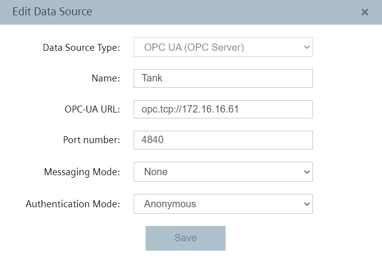
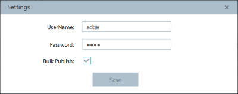
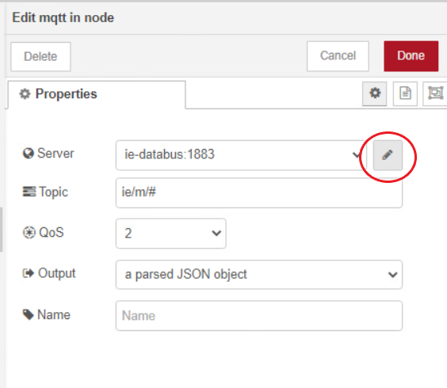

# Configuration

- [Configuration](#configuration)
  - [Configure IE Databus](#configure-ie-databus)
  - [Configure IE S7 Connector](#configure-ie-s7-connector)
  - [Collect data in IE Flow Creator and calculate KPIs](#collect-data-in-ie-flow-creator-and-calculate-kpis)
  - [Create custom data source (new metadata, publish data to new topic)](#create-custom-data-source-new-metadata-publish-data-to-new-topic)
  - [Install and configure OPC UA configurator and application](#install-and-configure-opc-ua-configurator-and-application)
  
## Configure IE Databus

In your IEM open the IE Databus and launch the configurator.
Add a user with this topic:
`"ie/#"`

Deploy the configuration.

## Configure IE S7 Connector

In your IEM open the Simatic S7 Connector and launch the configurator.

Add a data source:

Add needed tags (since we want to write variable values into the PLC, set "Read & Write" as access mode):

Edit the settings for Databus in upper right corner:

>Hint: Username and password should be the same as it was set in the IE Databus configuration, e.g., "edge" / "edge".

Deploy and start the project.

## Collect data in IE Flow Creator and calculate KPIs

Open the IE Flow Creator App from the IED Web UI and import the [FlowCreator.JSON](src/FlowCreator.JSON) file from the source folder.

After importing the JSON file, the password for IE Databus must be entered in the security settings of the MQTT-node.

## Create custom data source (new metadata, publish data to new topic)

## Install and configure OPC UA configurator and application
